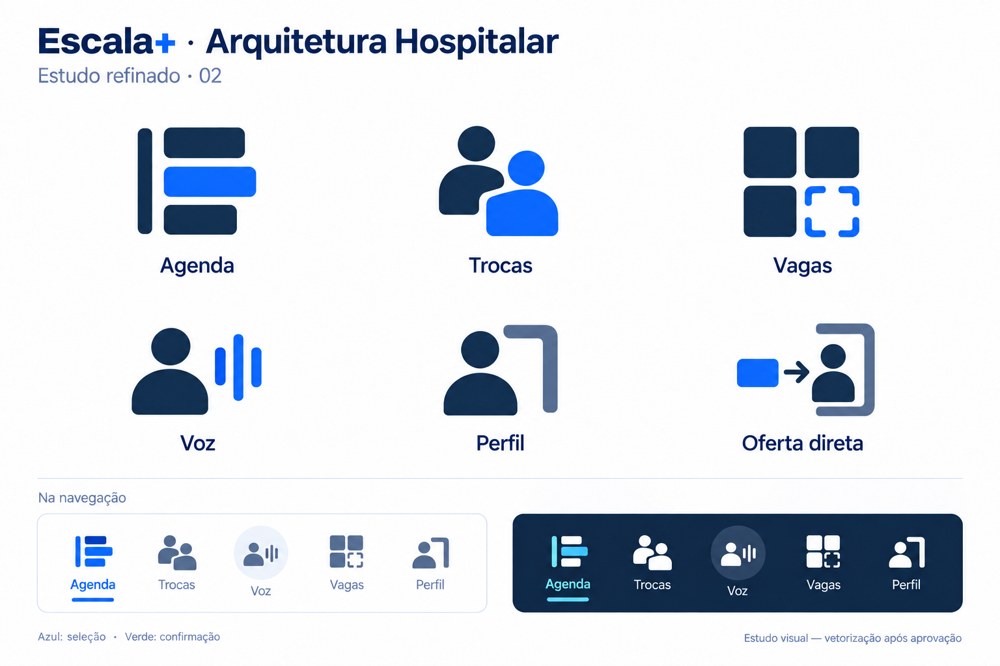

# Sistema de ícones — Arquitetura Hospitalar

> **Status:** direção visual aprovada para vetorização.
> **Registro:** 09/09/2026.
> **Implantação:** fora da próxima build. Nenhum ícone do aplicativo muda
> até existir uma frente própria de implementação, revisão visual e validação
> em iOS, Android e web.

## Decisão

O Escala+ adotará a família autoral **Arquitetura Hospitalar**. Ela representa
plantões, setores e vínculos profissionais por blocos estruturais, espaços
vazios e encaixes geométricos. O objetivo é distinguir a interface de
bibliotecas genéricas de ícones sem reduzir a compreensão em uma tela móvel.

Essa família complementa o contrato visual de [UI Design System](./ui-system.md):
mantém a paleta, os papéis semânticos e a tipografia do produto. Não cria uma
segunda identidade visual.

## Regras da família

- A construção parte de uma grade óptica de 24 × 24, com versões legíveis em
  16, 20, 24 e 28 px.
- Traços, blocos e cantos seguem uma espessura e um raio consistentes. A
  definição exata será consolidada na fonte SVG antes da implementação.
- O espaço vazio faz parte do símbolo: ele representa vaga, separação entre
  profissionais ou encaixe operacional. Não é decorativo.
- Cada ícone precisa ser reconhecível sem depender de cor. Cor reforça estado,
  nunca é a única informação.
- Símbolos de navegação devem permanecer simples em tamanho reduzido. Ações
  críticas mantêm rótulo textual e acessível.
- Os desenhos serão vetores originais do Escala+, documentados neste contrato;
  não devem copiar ou traçar bibliotecas de terceiros.

## Símbolos aprovados

| Função | Construção visual | Significado operacional |
| --- | --- | --- |
| Agenda | Espinha vertical e três módulos de plantão | organização dos turnos e leitura da escala |
| Trocas | Duas figuras humanas encaixadas por um canal negativo | troca entre dois profissionais |
| Vagas | Três módulos ocupados e uma célula vazia delimitada | posto disponível para assumir ou alocar |
| Voz | Uma figura humana e três barras sonoras | interação por voz no contexto da escala |
| Perfil | Uma pessoa em moldura institucional em L | identidade e vínculo com a instituição |
| Oferta direta | Módulo de plantão orientado a uma pessoa identificada | oferta de plantão a profissional específico |

`Trocas` e `Oferta direta` são deliberadamente diferentes: a primeira mostra
duas pessoas em relação simétrica; a segunda mostra um plantão direcionado a
uma pessoa.

## Navegação móvel

A barra principal usa, nesta ordem: **Agenda**, **Trocas**, **Voz**, **Vagas**
e **Perfil**. A ação de voz pode ocupar o centro em um contêiner circular, mas
o símbolo interno continua sendo o mesmo da família.

O item selecionado usa `primary.600` (`#2563EB`) em superfície clara e uma
variação azul clara com contraste suficiente em superfície escura. Verde fica
reservado a confirmação concluída, conforme os tokens `success.*`; não indica
seleção de aba.

## Critérios para a frente de vetorização

Antes de qualquer troca no aplicativo, a frente responsável deve entregar:

1. fontes SVG originais dos seis símbolos e suas variantes de estado;
2. componentes tipados para iOS, Android e web, com rótulos de acessibilidade;
3. comparação visual nas densidades de 16, 20, 24 e 28 px, em fundos claro e
   escuro;
4. validação de contraste e área de toque mínima de 44 × 44 px;
5. uma PR exclusiva de ícones, sem misturar mudanças de fluxo, autenticação,
   banco ou build.

Esta decisão não autoriza alteração da navegação atual, nem criação de nova
build. Ela fornece o contrato visual para uma implementação posterior.
